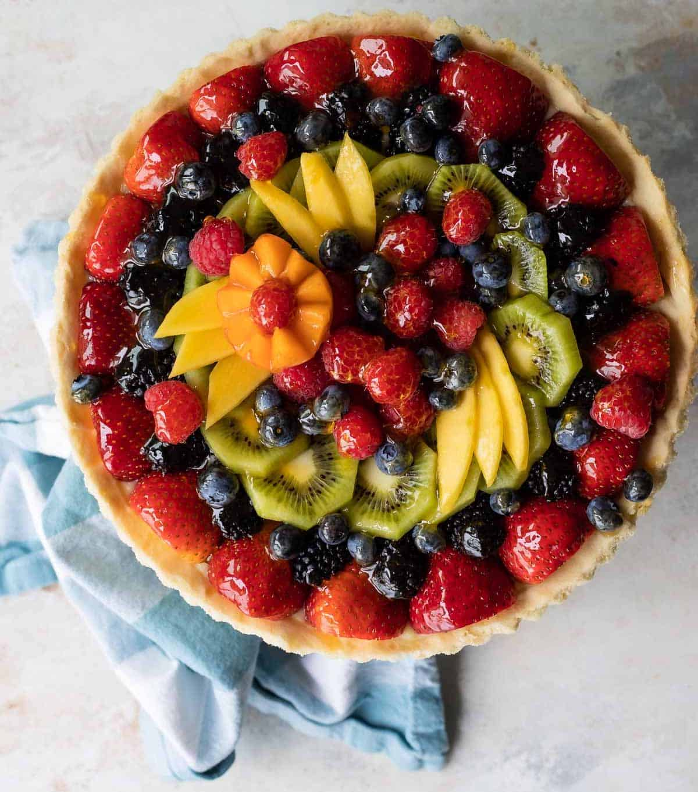

# Fruit Tart Recipe [Source](https://www.culinaryhill.com/fresh-fruit-tart/)

## Description
Loaded with a lush assortment of seasonal berries and other fruit, there’s nothing quite as lovely as a **Fresh Fruit Tart**. You’ll also learn some baking basics, like a tart crust and pastry cream, along the way.

Fresh Fruit Tarts are a professional-looking dessert that *anyone* can master. If you’ve never gotten the hang of crumb coats on cakes or pastry bags full of frosting, fear not. This is a dessert you can handle.

## Equipment
- Tart Pan
- Stand Mixer
- Rolling Pin
- Non-Aluminum Saucepan
           
## Ingredients

### For the pastry cream:
- 1/2 vanilla bean
- 2 cups whole milk
- 1 cup granulated sugar
- 6 egg yolks
- 1/4 cup cornstarch
- 1/4 teaspoon salt

### For the tart dough:
- 7 tablespoons butter softened
- 1/2 cup powdered sugar
- 1 egg
- 1/2 teaspoon vanilla extract
- 1/4 teaspoon salt
- 1/4 cups all-purpose flour sifted
- 1/4 teaspoon baking powder

### For the fruit tart:
- 1 pint fresh cut fruit assortment
- melted apricot jam

## Instructions

### To make the pastry cream:
1. In a medium non-aluminum saucepan over medium heat, heat milk until tiny bubbles appear on the surface, about 6 to 8 minutes (180 degrees). Stir to prevent scalding.
2. In a large bowl, whisk together egg yolks and sugar. Whisk in cornstarch and salt. While whisking constantly, pour in half of the hot milk. Whisk in remaining hot milk and return to saucepan.
3. Cook over medium heat, whisking constantly, until the mixture thickens to a firm consistency, about 5 to 8 minutes. Whisk in vanilla and pour in to a bowl.
4. Cover with plastic wrap, pressing it directly on to the surface of the pastry cream. Refrigerate until chilled, about 2 to 3 hours.

### To make the tart dough:
1. In a standing mixer fit with the paddle attachment, or with an electric mixer by hand, cream the butter and powdered sugar together on medium-high speed until pale and fluffy, about 3 minutes.
2. Scrape down the sides of the bowl and add egg. Continue mixing until combined, scraping down the bowl as necessary. Add vanilla and salt and mix until combined.
3. Reduce mixer speed to low. Add flour and baking powder and blend until the dough comes together (do not over-mix). Scrape dough onto a piece of plastic wrap. Wrap tightly and chill at least 1 hour.

### To blind-bake the tart crust:
1. Preheat oven to 350 degrees. On a lightly floured surface, roll out dough to a thickness of 1/8-inch to 1/4-inch. If the dough crumbles or breaks apart, press it back together with your fingertips.
2. Loosely roll the dough around the rolling pin, then gently unroll it over the tart pan, preferably with a removable bottom (9 inches, or substitute a pie plate).
3. Press the dough firmly into the bottom of the pan and up the sides. Trim any excess dough. Cover the dough with parchment paper or foil. Fill with pie weights or dried beans (you will need about 2 pounds, see note 4). Bake 12 minutes.
4. Remove pie weights or beans and parchment paper or foil. Return to oven and bake until golden brown and fully cooked, about 10 to 15 minutes longer. Cool completely.

### To assemble the fruit tart:
1. Fill cooled tart crust with chilled pastry cream. Arrange fruit in a decorative pattern.
2. Using a pastry brush, brush fruit with melted apricot glaze (reheat as necessary if glaze cools and becomes too sticky).
