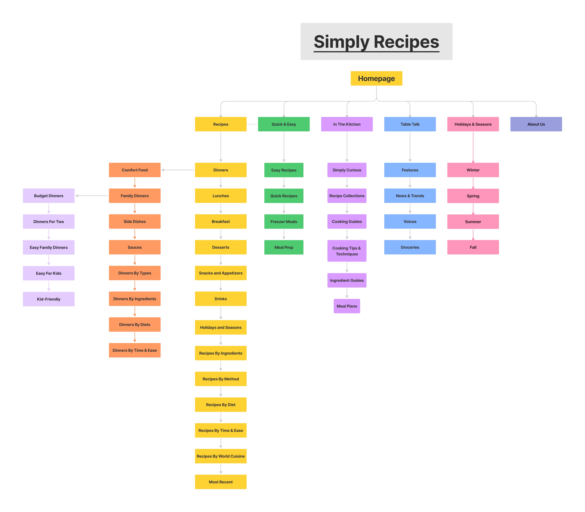

# 1. Site Map

# 2. Article Reaction
I learned that wireframing involves a lot of communication and iterative work. 
There's a whole process before, during, and after you finish designing.
It's super important to get the user specifications right before starting to design. 
A lot of the details of how users will interact with the app need to be hashed out beforehand.
It's also crucial to communicate with stakeholders to make sure the product is serving its purpose.
Continuous feedback is imperative to ensure effective communication through the designs.
